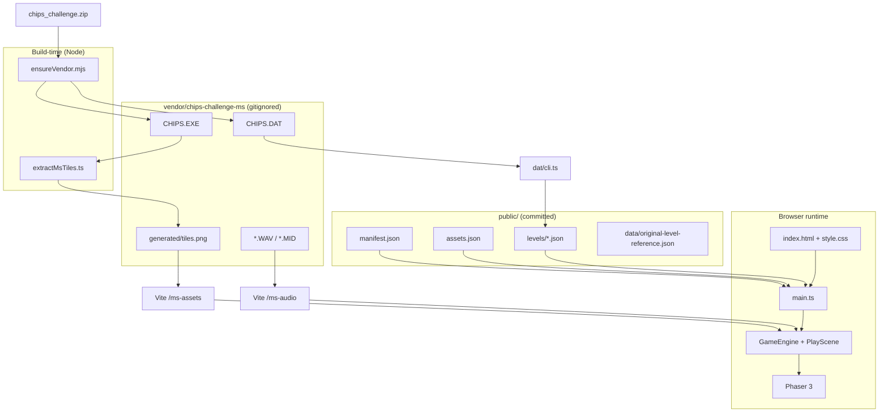
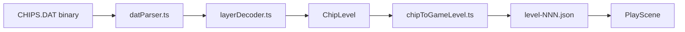
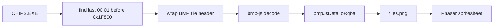

# Architecture

This document describes how the Chip's Challenge web prototype is structured: major components, data flows, and dependencies between the browser client, build tooling, and licensed MS game files.

## System overview

The project splits into three cooperating planes:

| Plane | Role |
|-------|------|
| **Licensed sources** | `CHIPS.DAT` (levels), `CHIPS.EXE` (tiles), audio — gitignored under `vendor/` |
| **Build / CLI tools** | Node scripts that extract tiles and export level JSON into `public/` |
| **Runtime (browser)** | Vite-hosted SPA: DOM shell + Phaser game reading JSON and PNG from HTTP |



## Runtime architecture

### Shell (DOM)

`index.html` defines the page chrome:

- Header title (updated from `manifest.json`)
- Zoom controls (`#zoom-in`, `#zoom-out`, `#zoom-label`)
- Phaser parent `#game-container`
- D-pad buttons (`data-dir` attributes)

`src/style.css` lays out the flex column, Win95-style controls, game aspect ratio, and `image-rendering: pixelated` on the canvas.

`src/main.ts` is the entry point: it does **not** import Phaser scenes directly into the DOM beyond bootstrapping.

### Application bootstrap

```
main.ts
  ├── loadGameManifest("/games/chips-challenge-100/manifest.json")
  ├── GameEventBus          (direction events)
  ├── DirectionInput        (keyboard + d-pad → bus)
  ├── GameEngine.start(manifest, bus, { sceneMap: { Play: PlayScene } })
  └── bindZoomControls(game) → pixelZoom registry + "pixel-zoom-changed"
```

`GameEngine` (`src/engine/GameEngine.ts`):

- Merges base Phaser config (1024×1080, `FIT`, pixelArt, roundPixels) with `manifest.phaser`
- Instantiates `Phaser.Game` with parent `#game-container`
- Stores `manifest` and `eventBus` on `game.registry` for scenes

### Play scene (game loop)

`PlayScene` (`src/scenes/PlayScene.ts`) is the only scene today. On `create()`:

1. Reads `manifest` and `eventBus` from registry
2. Observes `#game-container` with `ResizeObserver` for display zoom
3. Async `boot()`:
   - `loadAssetManifest` → `assets.json`
   - `loadLevelsIndex` → `levels/index.json`
   - `loadLevel` → e.g. `level-001.json`
   - `buildMsFrameIndexByTileId()` → map tile string id → spritesheet frame index
   - Loads `ms_tiles` spritesheet from `/ms-assets/tiles.png` (via manifest / assets)
4. `buildPlayfield()`:
   - Places one sprite per cell (composite upper/lower tile, skip chip cells)
   - Chip sprite on `playerStart`
   - Subscribes to `bus.onDirection` for grid movement
5. `applyIntegerDisplayZoom()` when layout or zoom changes

**Input path (decoupled from Phaser):**

```text
DOM keydown / d-pad click
  → DirectionInput
  → GameEventBus.emitDirection
  → PlayScene.onDirection
  → levelRuntime (collision / bounds)
  → chip sprite position + walk frame
```

### Display zoom

`src/engine/pixelZoom.ts` holds user zoom level in `game.registry` and applies **integer** `scale.setZoom()` based on `#game-container` size. It must not call `scale.refresh()` from a resize handler (that caused a `resize` event loop). See [development-notes.md](./development-notes.md).

### Config loading

`ConfigLoader.ts` is a thin `fetch` + JSON parse layer for:

| Type | Typical URL |
|------|-------------|
| `GameManifest` | `/games/chips-challenge-100/manifest.json` |
| `AssetManifest` | `/games/chips-challenge-100/assets.json` |
| `LevelsIndex` | `/games/chips-challenge-100/levels/index.json` |
| `LevelData` | per-level JSON under `levels/` |

Shared TypeScript shapes live in `src/engine/types.ts`.

## DAT pipeline (levels)

Levels in the browser use a **game-neutral JSON** format (`LevelData`), produced offline from `CHIPS.DAT`.



### Module responsibilities

| Module | Responsibility |
|--------|----------------|
| `binaryReader.ts` | Little-endian reads for DAT structures |
| `datParser.ts` | File magic, level directory, per-level fields, RLE layer blobs |
| `layerDecoder.ts` | Decompress CC1 layer streams → tile byte grid |
| `tiles.ts` | Byte → string id (`wall`, `chip_n`, …), blocking sets |
| `metadata.ts` | Title, hint, password XOR, etc. |
| `validate.ts` | Optional consistency checks + warnings |
| `chipToGameLevel.ts` | `ChipLevel` → `LevelData` (player start, layers, monsters) |
| `cli.ts` | CLI: single level or `--extract` directory |

**Runtime consumption:** `PlayScene` only sees `LevelData`. It does not parse DAT in the browser.

**Composite tiles at play time:** `levelRuntime.getCompositeTile` — upper layer wins unless `empty`, then lower. Movement blocking uses `BLOCKING_TILE_IDS` and chip tile ids from `tiles.ts`.

## Tile graphics pipeline (EXE → PNG)

MS tile art is not stored in DAT. It lives in `CHIPS.EXE` as embedded bitmap **OBJ32_4** (RLE4 DIB at file offset `0xD800`).



| Module | Responsibility |
|--------|----------------|
| `scripts/extractMsTiles.ts` | Orchestrates extraction; writes `generated/tiles.png` + `tiles.json` |
| `bmpJsToRgba.ts` | Fixes bmp-js channel order `[0,B,G,R]` → `[R,G,B,A]` |
| `msDisplayPalette.ts` | Documents embedded VGA palette (reference; not patched at extract) |
| `bmpRle4.ts` | Experimental RLE decoder / DIB reader (tests, not production extract) |
| `msObjectToFrame.ts` | Object code `0x00`–`0x6F` → frame index in 13×16 grid |
| `msTileFrames.ts` | Builds `Map<tileId, frame>` from `TILE_NAMES` |

**Frame layout** matches MS `GetTileImagePos`: column = high nibble of object code, row = low nibble (32×32 pixels per cell, 13 columns × 16 rows).

At runtime, `PlayScene` loads the sheet as Phaser key `ms_tiles` with 32×32 frames and `FilterMode.NEAREST`.

## Vite and static assets

`vite.config.ts` bridges gitignored vendor files to URLs the game can load:

| URL prefix | Filesystem | Purpose |
|------------|------------|---------|
| `/ms-assets/*` | `vendor/.../generated/` | `tiles.png`, `tiles.json` |
| `/ms-audio/*` | `vendor/chips-challenge-ms/` | `*.WAV`, `*.MID` |

On `build`, a plugin copies those into `dist/ms-assets` and `dist/ms-audio`.

Committed game content under `public/games/chips-challenge-100/` is served at `/games/chips-challenge-100/...` by Vite’s static file handling.

## Build orchestration

| Script | When | Action |
|--------|------|--------|
| `predev.mjs` | Before `dev` / `build` | `ensureVendor` → optional `ms:extract` → optional `dat:level1` |
| `ensureVendor.mjs` | Manual / predev | Unzip `chips_challenge.zip` if present |
| `extractMsTiles.ts` | `ms:extract` | Regenerate tile PNG |
| `dat/cli.ts` | `dat:level1`, `dat:all` | DAT → JSON |
| `buildOriginalLevelReference.mjs` | `data:original-levels` | Passwords / metadata reference JSON |

`npm run dev` therefore often refreshes `level-001.json` and tiles automatically when vendor files exist.

## Configuration chain

Runtime pieces are wired through JSON manifests (URLs only, no hardcoded level paths in TypeScript except defaults):

```text
manifest.json
  ├── initialScene: "Play"
  ├── assetManifestUrl → assets.json (spritesheet keys, audio paths)
  ├── levelsIndexUrl → levels/index.json
  ├── msAssets.tilesUrl → /ms-assets/tiles.png
  └── phaser.scale → merged into GameEngine

levels/index.json
  └── levels[].url → level-001.json

level-001.json (LevelData)
  ├── layers.upper / layers.lower (string tile ids)
  ├── playerStart, timeLimit, chipsRequired
  └── monsters (optional)
```

To add a level: export JSON, add an entry to `levels/index.json`, set `defaultLevelId` if needed. That field is the **launch default** for the web app (`resolveDefaultLaunchLevelNumber` in `2d-tile-engine`); `?password=` only overrides for dev/deep links.

## Layering and dependencies

```text
┌─────────────────────────────────────────────────────────┐
│  index.html / style.css / main.ts                       │
├─────────────────────────────────────────────────────────┤
│  scenes/PlayScene          engine/GameEngine            │
│                            engine/DirectionInput        │
│                            engine/pixelZoom             │
│                            engine/levelRuntime          │
│                            engine/ConfigLoader          │
│                            engine/types                 │
├─────────────────────────────────────────────────────────┤
│  dat/tiles, msObjectToFrame  (tile ids ↔ MS frames)     │
├─────────────────────────────────────────────────────────┤
│  dat/* parser & CLI        (Node + tests; also imported │
│                             by scripts via tsx)         │
├─────────────────────────────────────────────────────────┤
│  scripts/*                 (extract, vendor, predev)    │
├─────────────────────────────────────────────────────────┤
│  Phaser 3 / Vite / sharp / bmp-js                       │
└─────────────────────────────────────────────────────────┘
```

**Dependency rule of thumb:**

- `engine/` must not import Phaser scene implementations; scenes import engine.
- `dat/` is usable from CLI, tests, and scripts without Phaser.
- `PlayScene` is the integration point: manifest + JSON levels + MS spritesheet + bus.

## Tests

| Test | What it guards |
|------|----------------|
| `test/datParser.test.ts` | DAT magic, 149 levels, level 1 title/password |
| `test/bmpRle4.test.ts` | Extracted `tiles.png` dimensions and color sanity |

Vitest runs in Node; vendor files are optional (`it.skipIf` when missing).

## Extension points

| Goal | Likely touch points |
|------|---------------------|
| More levels | `dat/cli.ts --extract`, `levels/index.json` |
| MS rules (doors, monsters) | New engine module; expand `PlayScene` / replace `levelRuntime` |
| Masked tile drawing | `PlayScene` compositing; columns 7–12 of tile sheet |
| Background / audio | Load from `assets.json` audio map; EXE background bitmap |
| Second game / scene | New `manifest.json`, scene in `sceneMap`, optional `public/games/<id>/` |
| Lynx ruleset | Separate DAT magic path already partially documented in parser |

## Related docs

- [README.md](../README.md) — quick start
- [development-notes.md](./development-notes.md) — bugs and fixes during prototyping
- [VENDOR_SETUP.md](../VENDOR_SETUP.md) — licensed file layout
