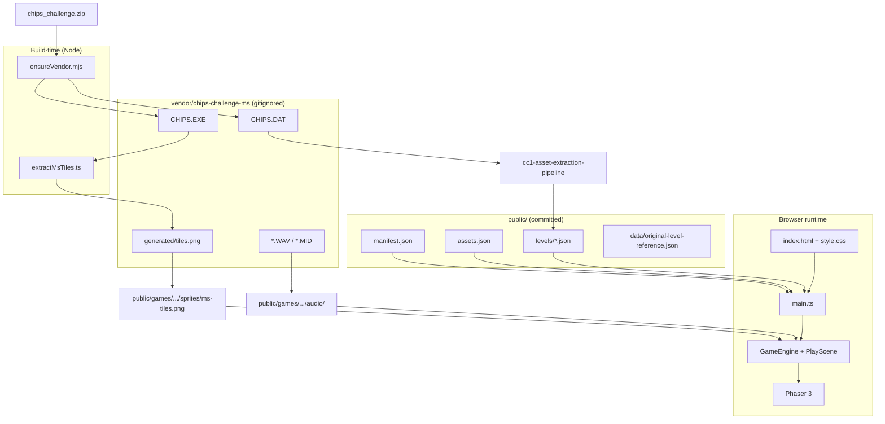
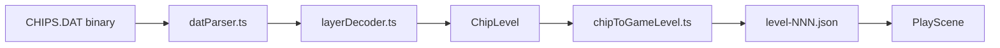
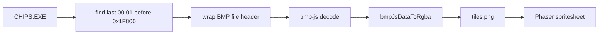

# Architecture

This document describes how the Chip's Challenge web prototype is structured: major components, data flows, and dependencies between the browser client, build tooling, and licensed MS game files.

## System overview

The project splits into three cooperating planes (engine is in this repo):

| Plane | Role |
|-------|------|
| **Licensed sources** | `CHIPS.DAT` (levels), `CHIPS.EXE` (tiles), audio — gitignored under `vendor/` |
| **Build / CLI tools** | Node scripts that extract tiles and export level JSON into `public/` |
| **Runtime (browser)** | Vite-hosted SPA: DOM shell + Phaser game reading JSON and PNG from HTTP |



## Runtime architecture

### Shell (DOM)

`index.html` defines the page chrome:

- Header title (updated from `manifest.json`)
- Zoom controls (`#zoom-in`, `#zoom-out`, `#zoom-label`)
- Phaser parent `#game-container`
- D-pad buttons (`data-dir` attributes)

`src/style.css` lays out the flex column, Win95-style controls, game aspect ratio, and `image-rendering: pixelated` on the canvas.

`src/main.ts` is the entry point: it does **not** import Phaser scenes directly into the DOM beyond bootstrapping.

### Application bootstrap

```
main.ts
  ├── loadGameManifest("/games/chips-challenge-1/manifest.json")
  ├── GameEventBus          (direction events)
  ├── DirectionInput        (keyboard + d-pad → bus)
  ├── GameEngine.start(manifest, bus, { sceneMap: { Play: PlayScene } })
  └── bindZoomControls(game) → pixelZoom registry + "pixel-zoom-changed"
```

`GameEngine` (`@engine/GameEngine.ts` via `packages/2d-tile-engine`):

- Merges base Phaser config (1024×1080, `FIT`, pixelArt, roundPixels) with `manifest.phaser`
- Instantiates `Phaser.Game` with parent `#game-container`
- Stores `manifest` and `eventBus` on `game.registry` for scenes

### Play scene (game loop)

`PlayScene` (`src/scenes/PlayScene.ts`) is the only scene today. On `create()`:

1. Reads `manifest` and `eventBus` from registry
2. Observes `#game-container` with `ResizeObserver` for display zoom
3. Async `boot()`:
   - `loadAssetManifest` → `assets.json`
   - `loadLevelsIndex` → `levels/index.json`
   - `loadLevel` → e.g. `level-001.json`
   - `buildMsFrameIndexByTileId()` → map tile string id → spritesheet frame index
   - Loads `ms_tiles` spritesheet from game pack `/games/chips-challenge-1/sprites/ms-tiles.png` (via manifest / assets)
4. `buildPlayfield()`:
   - Places one sprite per cell (composite upper/lower tile, skip chip cells)
   - Chip sprite on `playerStart`
   - Subscribes to `bus.onDirection` for grid movement
5. `applyIntegerDisplayZoom()` when layout or zoom changes

**Input path (decoupled from Phaser):**

```text
DOM keydown / d-pad click
  → DirectionInput
  → GameEventBus.emitDirection
  → PlayScene.onDirection
  → levelRuntime (collision / bounds)
  → chip sprite position + walk frame
```

### Display zoom

`@engine/pixelZoom` (`packages/2d-tile-engine`) holds user zoom level in `game.registry` and applies **integer** `scale.setZoom()` based on `#game-container` size. It must not call `scale.refresh()` from a resize handler (that caused a `resize` event loop). See [known-issues.md](./known-issues.md).

### Config loading

`ConfigLoader.ts` is a thin `fetch` + JSON parse layer for:

| Type | Typical URL |
|------|-------------|
| `GameManifest` | `/games/chips-challenge-1/manifest.json` |
| `AssetManifest` | `/games/chips-challenge-1/assets.json` |
| `LevelsIndex` | `/games/chips-challenge-1/levels/index.json` |
| `LevelData` | per-level JSON under `levels/` |

Shared TypeScript shapes live in **packages/2d-tile-engine** (`engine/types.ts`).

## DAT pipeline (levels)

Levels in the browser use a **game-neutral JSON** format (`LevelData`), produced offline from `CHIPS.DAT`.



### Module responsibilities (cc1-asset-extraction-pipeline)

| Module | Responsibility |
|--------|----------------|
| `binaryReader.ts` | Little-endian reads for DAT structures |
| `datParser.ts` | File magic, level directory, per-level fields, RLE layer blobs |
| `layerDecoder.ts` | Decompress CC1 layer streams → tile byte grid |
| `@tile-engine/tiles` (engine) | Byte → string id (`wall`, `chip_n`, …), blocking sets |
| `chipToGameLevel.ts` | `ChipLevel` → engine `LevelData` (compact layers) |
| `dat-to-json` CLI | Writes into `chips-challenge-web/.../public/games/chips-challenge-1/` (see pipeline `docs/EXPORT.md`) |

**Runtime consumption:** `PlayScene` only sees `LevelData`. It does not parse DAT in the browser.

**Composite tiles at play time:** `levelRuntime.getCompositeTile` — upper layer wins unless `empty`, then lower. Movement blocking uses `BLOCKING_TILE_IDS` and chip tile ids from `tiles.ts`.

## Tile graphics pipeline (EXE → PNG)

MS tile art is not stored in DAT. It lives in `CHIPS.EXE` as embedded bitmap **OBJ32_4** (RLE4 DIB at file offset `0xD800`).



| Module | Responsibility |
|--------|----------------|
| Pipeline `tools/extraction/extractMsTiles.ts` | Orchestrates extraction; writes `vendor/.../generated/tiles.png` |
| Engine `msTileFrames.ts` | Builds `Map<tileId, frame>` from tile ids at runtime |
| Engine `tile-engine/msTileIndex.ts` | Object code → frame index in 13×16 grid |

**Frame layout** matches MS `GetTileImagePos`: column = high nibble of object code, row = low nibble (32×32 pixels per cell, 13 columns × 16 rows).

At runtime, `PlayScene` loads the sheet as Phaser key `ms_tiles` with 32×32 frames and `FilterMode.NEAREST`.

## Vite and static assets

MS tiles and SFX ship inside the game pack under `public/games/chips-challenge-1/` (`sprites/ms-tiles.png`, `audio/*.WAV`). Vite serves them at `/games/chips-challenge-1/...`.

`vite.config.ts` dev/preview middleware falls back to gitignored `vendor/.../generated/tiles.png` (and install WAVs) when committed pack files are missing — **production builds have no fallback**.

Populate the pack with `npm run sync:ms-pack` after `ms:extract`, then commit.

## Build orchestration

| Script | When | Action |
|--------|------|--------|
| `predev.mjs` | Before `dev` / `build` | `ensureVendor` → `ms:extract` if tiles missing → `dat:levels` only if `CHIPS.DAT` is newer than level JSON (or `CC1_FORCE_DAT_EXPORT=1`) |
| `ensureVendor.mjs` | Manual / predev | Unzip `chips_challenge.zip` if present |
| `runMsExtract.mjs` → pipeline extract | `ms:extract` | Regenerate tile PNG under `vendor/` |
| `cc1-asset-extraction-pipeline` `dat-to-json` | `dat:levels`, `dat:levelN` | DAT → game pack JSON |
| `buildOriginalLevelReference.mjs` | `data:original-levels` | Passwords / metadata reference JSON |

`npm run dev` regenerates tiles on first run when vendor exists; level re-export runs only when DAT is newer than committed levels (see `scripts/predev.mjs`).

## Configuration chain

Runtime pieces are wired through JSON manifests (URLs only, no hardcoded level paths in TypeScript except defaults):

```text
manifest.json
  ├── initialScene: "Play"
  ├── assetManifestUrl → assets.json (spritesheet keys, audio paths)
  ├── levelsIndexUrl → levels/index.json
  ├── msAssets.tilesUrl → /games/chips-challenge-1/sprites/ms-tiles.png
  └── phaser.scale → merged into GameEngine

levels/index.json
  └── levels[].url → level-001.json

level-001.json (LevelData)
  ├── layers.upper / layers.lower (string tile ids)
  ├── playerStart, timeLimit, chipsRequired
  └── monsters (optional)
```

To add a level: export JSON, add an entry to `levels/index.json`, set `defaultLevelId` if needed. That field is the **launch default** for the web app (`resolveDefaultLaunchLevelNumber` in `packages/2d-tile-engine`); `?password=` only overrides for dev/deep links.

## Layering and dependencies

The web app imports simulation from **`packages/2d-tile-engine`** via `@engine` / `@tile-engine` aliases. DAT extraction stays in a sibling pipeline repo.

```text
┌─────────────────────────────────────────────────────────┐
│  chips-challenge-web                                    │
│  apps/chips-challenge-web (Phaser client)               │
│  packages/2d-tile-engine (@engine, @tile-engine)        │
│    GameEngine, levelRuntime, RunSession, msCc1/*        │
├─────────────────────────────────────────────────────────┤
│  cc1-asset-extraction-pipeline (offline only)           │
│  DAT parse → chipToGameLevel → public/games/.../levels  │
│  ms:extract → vendor/.../generated/tiles.png            │
├─────────────────────────────────────────────────────────┤
│  Phaser 3 / Vite                                        │
└─────────────────────────────────────────────────────────┘
```

**Dependency rule of thumb:**

- **`packages/2d-tile-engine`** must not import Phaser scenes; it exposes types and simulation. Extract it again when a second game is a real consumer.
- **cc1-asset-extraction-pipeline** depends on the engine for `LevelData`, tile ids, and `compactLayer`; it does not ship level JSON as its own product.
- **PlayScene** is the integration point: manifest + JSON levels + MS spritesheet + event bus.

Game pack id and paths for scripts: `GAME_PACK_ID` in `apps/chips-challenge-web/scripts/cc1Paths.mjs` (`chips-challenge-1`).

## Tests

| Location | What it guards |
|----------|----------------|
| **cc1-asset-extraction-pipeline** | DAT parse, level export, lesson smoke cases |
| **packages/2d-tile-engine** | MS movement, monsters, keys, compact layers, run session |
| **apps/chips-challenge-web** | Auto Play bold routes, pack/touch smoke tests (see [status/cleanup.md](./status/cleanup.md)) |

`npm test` at the repo root runs web and engine Vitest suites. Vendor files are optional where tests read `CHIPS.DAT`.

## Extension points

| Goal | Likely touch points |
|------|---------------------|
| More levels | `npm run dat:levels` in web (pipeline CLI), `levels/index.json` |
| MS rules (doors, monsters) | New engine module; expand `PlayScene` / replace `levelRuntime` |
| Masked tile drawing | `PlayScene` compositing; columns 7–12 of tile sheet |
| Background / audio | Load from `assets.json` audio map; EXE background bitmap |
| Second game / scene | New `manifest.json`, scene in `sceneMap`, optional `public/games/<id>/` |
| Lynx ruleset | Separate DAT magic path already partially documented in parser |

## Related docs

- [README.md](../README.md) — quick start
- [status/cleanup.md](./status/cleanup.md) — phased repo cleanup and mobile follow-up
- [known-issues.md](./known-issues.md) — open gameplay / UX gaps
- [VENDOR_SETUP.md](../VENDOR_SETUP.md) — licensed file layout
