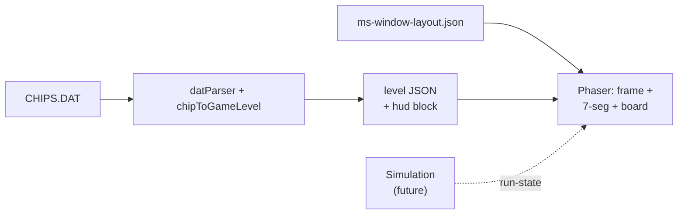

# UI and HUD — extraction → visualization

MS Chip's Challenge shows **level progress and inventory in chrome beside the board** (separate child windows in `CHIPS.EXE`). This project renders that chrome **inside the Phaser play canvas** using a community spritesheet rip; the app header above remains HTML for meta-settings.

## EXE / DAT vs spritesheet

| Source | What we found |
|--------|----------------|
| `CHIPS.EXE` | Tile bitmap `OBJ32_4` @ `0xD800`, background bitmap (not wired yet). **No single combined “play window” bitmap** in our extraction — original uses separate Win16 child windows for info + inventory. |
| `CHIPS.DAT` | Per-level time limit, chips required, title (feeds counter seed data). |
| `spritesheet_window.png` | **Used for chrome** — green circuit frame, gray status panel, 7-segment digits, inventory slots (community rip; see file footer credit). |

## Pipeline: extraction → HUD



### Stage 1 — Static seed (current)

`chipToGameLevel` writes `hud` from DAT header:

| Field | DAT source | Counter |
|-------|------------|---------|
| `hud.levelNumber` | Level index | **LEVEL** (3-digit) |
| `hud.timer.initialSeconds` | Time word | **TIME** |
| `hud.chipCounter.initial` | Chips required | **CHIPS LEFT** (remaining-style) |

Layout metrics (frame crop, viewport, display rects, digit atlas, inventory grid) live in `public/games/chips-challenge-100/ui/ms-window-layout.json`.

The board draws at **9px per cell** inside a **288×288** viewport (32×32 grid), matching the ripped window art. Tile art still comes from the 32×32 MS sheet, scaled down per cell.

### Stage 2 — Run state (with Phase 1 simulation)

Simulation emits generic state; `PlayScene` forwards `run-state` to `MsWindowHud`:

```json
{
  "timer": { "secondsRemaining": 87 },
  "collectiblesLeftCount": 4
  "inventory": { "key_blue": 1, "flippers": 1 }
}
```

Inventory icons use `ms_tiles` frames when count &gt; 0.

## Page layout

| Region | Technology | Purpose |
|--------|------------|---------|
| `.app-header` | HTML | Title + future meta-settings |
| `#game-container` | Phaser 533×360 | Full MS window (frame + board + counters + inventory) |
| D-pad / zoom | HTML | Touch + accessibility controls |

## File map

| File | Role |
|------|------|
| `sprites/spritesheet_window.png` | Chrome + digit glyph atlas |
| `ui/ms-window-layout.json` | Crop rects and slot positions |
| `src/ui/msWindowLayout.ts` | Layout types + digit frame registration |
| `src/ui/MsSevenSegment.ts` | 3-digit readout |
| `src/ui/MsWindowHud.ts` | Frame, counters, inventory icons |
| `src/scenes/PlayScene.ts` | Loads assets, builds board + HUD |
| `src/engine/pixelZoom.ts` | `MS_WINDOW_WIDTH` / `HEIGHT` = 533×360 |
| `manifest.json` | `windowLayoutUrl`, Phaser scale size |

## Checklist before Phase 1 (simulation)

- [x] MS window frame in Phaser (spritesheet)  
- [x] 7-segment LEVEL / TIME / CHIPS counters  
- [x] Inventory slot positions (icons when simulation adds counts)  
- [x] `hud` block on exported level JSON  
- [ ] Timer countdown tick  
- [ ] Live chips remaining vs collected  
- [ ] Hint line from DAT field 7 (optional)  

## Related docs

- [game-data-model.md](./game-data-model.md)  
- [architecture.md](./architecture.md)  
